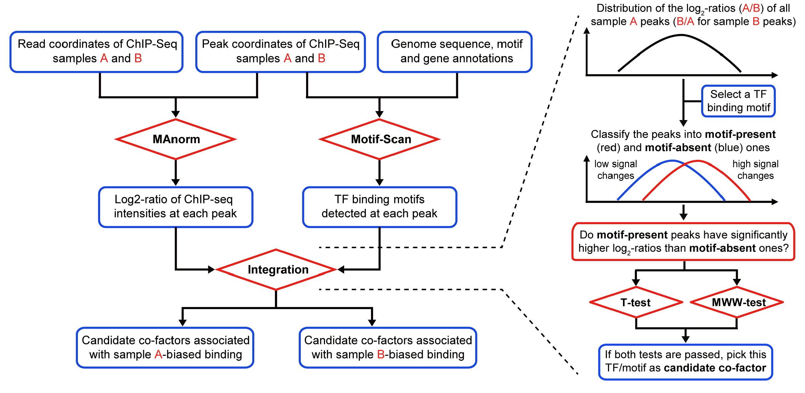

.. _intro:

Introduction
------------

**MAmotif** is used to compare two ChIP-seq samples of the same protein from different cell types or conditions
(e.g. Mutant vs Wild-type) and **identify transcriptional factors (TFs) associated with the cell-type biased binding**
of this protein as its **co-factors**, by using TF binding information obtained from motif analysis
(or from other ChIP-seq data).

MAmotif automatically combines **MAnorm** model to perform quantitative comparison on given ChIP-seq samples together
with Motif-Scan toolkit to scan ChIP-seq peaks for **TF binding motifs**, and uses a systematic integrative analysis to
search for TFs whose binding sites are significantly associated with the cell-type biased peaks between two ChIP-seq samples.

When applying to ChIP-seq data of histone marks of regulatory elements (such as H3K4me3 for active promoters and
H3K9/27ac for active promoter/enhancers), or DNase/ATAC-seq data, MAmotif can be used to detect **cell-type specific regulators**.

Workflow
--------

